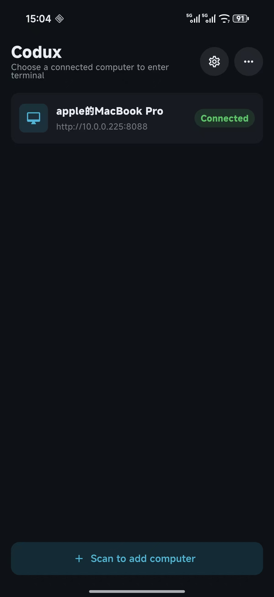
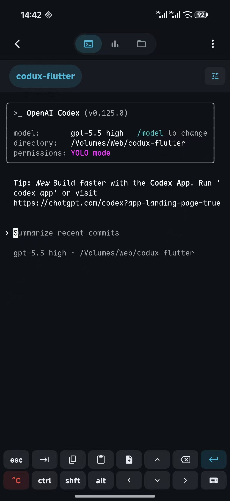

<h1 align="center">Codux Mobile</h1>

<p align="center">
  <strong>Codux macOS 终端工作台的原生移动端客户端。</strong>
</p>

<p align="center">
  <a href="https://github.com/duxweb/codux-flutter/releases">
    
  </a>
  <a href="LICENSE">
    
  </a>
  
  
  
</p>

<p align="center">
  <a href="https://github.com/duxweb/codux">macOS 端 Codux</a> &middot;
  <a href="https://github.com/duxweb/codux-flutter/releases">下载</a> &middot;
  <a href="https://github.com/duxweb/codux-flutter/issues">反馈</a>
</p>

<p align="center">
  <a href="README.md">English</a> | 简体中文
</p>

---

## 界面预览

<p align="center">
  
  
</p>

## 为什么需要 Codux Mobile？

macOS 端 Codux 负责真实项目、终端会话、AI 工具运行、文件操作和配对确认。Codux Mobile 是手机侧客户端，用移动端友好的方式连接这个工作台，远程显示和操作终端，同时避免手机输入法导致 macOS 端终端反复 resize。

移动端当前聚焦三件事：

- **稳定的 Android 终端渲染**：使用基于 Termux `TerminalView` / `TerminalEmulator` 的 Flutter 原生 PlatformView，不再走 WebView 或 xterm.js。
- **移动端输入体验**：支持快捷工具栏、输入法开关、文字选择、滚动历史、粘贴、图片上传，以及针对 TUI 程序调过的输入法避让。
- **接入 Codux 工作台**：扫码配对、设备列表、项目标签、终端分屏、文件浏览、AI 用量面板都通过 relay 服务连接 macOS host。

## 功能

| 模块 | 状态 | 说明 |
|:--|:--|:--|
| 配对 | 可用 | 扫描 macOS 端 Codux 的二维码，提交配对申请，等待 Mac 端确认。 |
| 设备管理 | 可用 | 本地保存多台 Mac，可编辑 relay 地址和设备名称，断线后后台重连。 |
| 远程终端 | 可用 | 通过 Android 原生终端插件渲染远程 PTY 输出，并把用户输入显式发回 Mac 端。 |
| 输入法处理 | 可用 | 输入法弹出时保持终端高度稳定，只移动显示区域，避免 TUI 界面被重绘压坏。 |
| 快捷键 | 可用 | 双排工具栏包含 Esc、Tab、复制、粘贴、上传、方向键、删除、回车、Ctrl、Shift、Alt、键盘开关和 `^C`。 |
| 文件 | 可用 | 浏览项目文件、记忆每个项目目录、打开/编辑文件、重命名、复制路径、删除。 |
| AI 统计 | 可用 | 展示 macOS 端转发的当前项目和近期 AI 用量。 |
| 更新检查 | 可用 | 读取 `duxweb/codux-flutter` 最新 GitHub Release。 |

## 架构

```text
Codux Mobile (Flutter)
  ├─ UI 外壳：设备列表、项目标签、文件面板、统计、工具栏
  ├─ 原生终端插件：Flutter PlatformView + Termux TerminalView
  └─ Relay 客户端：WebSocket 消息连接 Codux relay

Codux macOS host
  ├─ 持有项目、终端会话、PTY、文件和 AI 用量状态
  └─ 确认移动端配对并转发终端/文件/统计事件
```

移动端不作为终端会话的源头，只负责渲染、输入和交互。真实会话仍由 macOS 端工作台管理。

## 环境要求

- Flutter stable，Dart `^3.11.5`
- Android SDK 36
- JDK 17
- Android 8.0 / API 26 或更高
- 正在运行的 Codux macOS host 和 relay 配对码

## 开发

```bash
cd /Volumes/Web/codux-flutter
flutter pub get
flutter run
```

### 验证

```bash
flutter analyze
flutter test
flutter build apk --debug
flutter build apk --release
```

Debug APK：

```text
build/app/outputs/flutter-apk/app-debug.apk
```

Release APK：

```text
build/app/outputs/flutter-apk/app-release.apk
```

## 日志等级

Flutter 层和原生终端插件共用构建时日志等级：

```bash
flutter run --dart-define=CODUX_LOG_LEVEL=debug
flutter build apk --release --dart-define=CODUX_LOG_LEVEL=warn
```

支持等级：

- `debug`
- `info`
- `warn`
- `error`
- `off`

默认等级是 `warn`。Release workflow 默认也使用 `warn`，必要时可在手动 workflow 中调整。

## 发布

当前仓库已按 macOS 端的发布结构补齐：

- `CHANGELOG.md` 和 `CHANGELOG.zh-CN.md` 记录版本更新。
- `scripts/release/build-release-notes.sh` 从中英文更新日志提取 GitHub Release 内容。
- `.github/workflows/test-build.yml` 手动构建 debug / release APK。
- `.github/workflows/release-build.yml` 在 `v*` tag 推送时自动构建并发布 GitHub Release。

### Android 签名

正式发布需要在 GitHub 仓库配置这些 secrets：

- `CODUX_ANDROID_KEYSTORE_BASE64`
- `CODUX_ANDROID_KEYSTORE_PASSWORD`
- `CODUX_ANDROID_KEY_ALIAS`
- `CODUX_ANDROID_KEY_PASSWORD`

生成 keystore 的 base64 内容：

```bash
base64 -i codux-release.jks | pbcopy
```

本地没有 `android/key.properties` 时，release 构建会回退到 debug 签名，方便本地 `flutter run --release`。GitHub 正式发布会强制要求签名 secrets。

### 发布版本

1. 在 `CHANGELOG.md` 和 `CHANGELOG.zh-CN.md` 写入目标版本更新记录。
2. 如有需要，同步更新 `pubspec.yaml` 版本号。
3. 提交发布变更。
4. 打 tag 并推送：

```bash
git tag v1.0.0
git push origin main
git push origin v1.0.0
```

发布 workflow 会构建 `Codux-Mobile-<version>-android.apk`，生成 `SHA256SUMS.txt`，提取双语更新记录，并上传到 GitHub Releases。

## 目录结构

| 路径 | 说明 |
|:--|:--|
| `lib/` | Flutter 应用外壳、relay 客户端、页面、组件、主题和多语言。 |
| `plugin/codux_native_terminal/` | Flutter 使用的 Android 原生终端插件。 |
| `android/` | Android 应用壳和发布签名配置。 |
| `.github/workflows/` | 手动测试构建和 tag 触发发布构建。 |
| `scripts/release/` | 更新日志提取脚本。 |
| `docs/images/` | 截图预留目录。 |

## 开源协议

Codux Mobile 使用 GNU General Public License v3.0，和 macOS 端 Codux 保持一致。详情见 `LICENSE`。

## 相关项目

- [Codux for macOS](https://github.com/duxweb/codux)
- [Codux Mobile Releases](https://github.com/duxweb/codux-flutter/releases)
